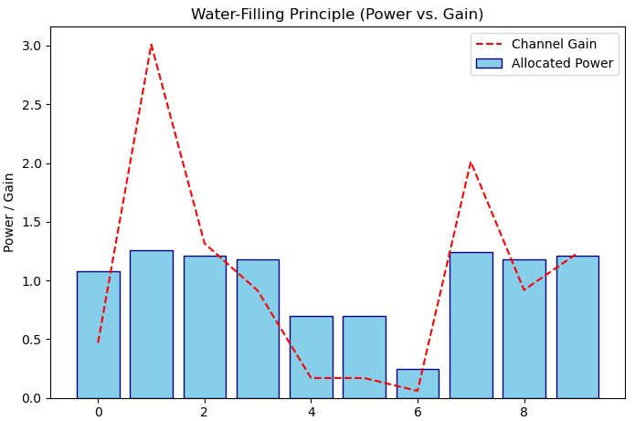
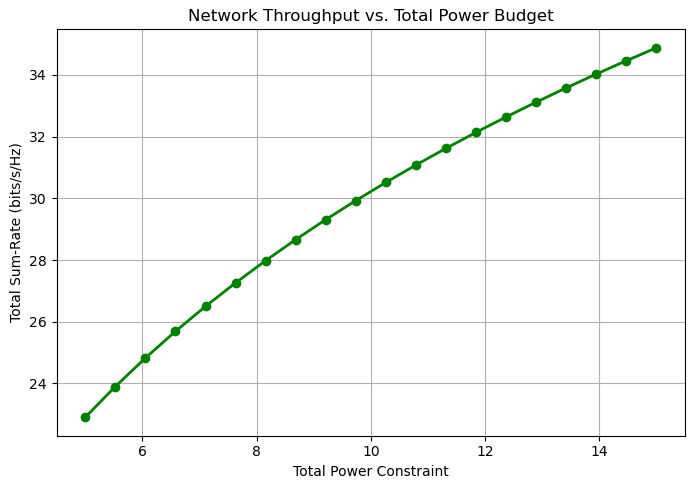
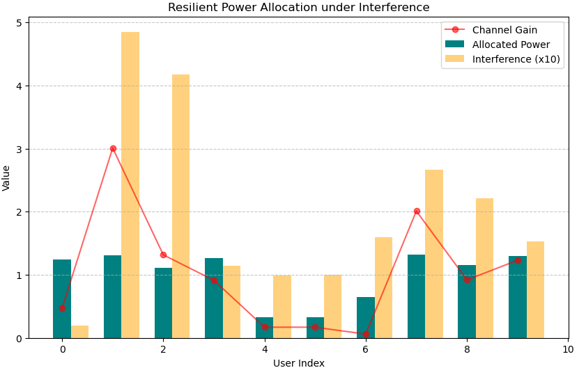
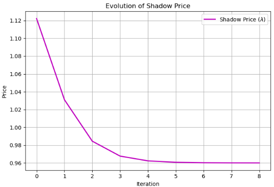

# Power Allocation Optimization for 5G Networks

**Author:** Ayyan Ahmed  
**Institution:** TU Darmstadt, M.Sc. Information & Communication Engineering  
**Focus:** Resilient Resource Allocation for Wireless Networks  

> A Python simulation demonstrating resilient downlink power allocation and interference management in 5G networks using Convex Optimization (CVXPY).

This repository contains a Python-based simulation project demonstrating advanced convex optimization techniques for resource allocation in 5G wireless networks. The project models a base station (gNB) distributing downlink transmit power across multiple users (UEs) to maximize network throughput while guaranteeing resilient Quality of Service (QoS).

---

## Mathematical Formulation

The core of this simulation relies on formulating the resource allocation task as a convex optimization problem.

### Objective: Sum-Rate Maximization
We aim to maximize the total spectral efficiency of the network across $N$ users, considering the channel gain $g_i$, allocated power $p_i$, noise variance $\sigma^2$, and external interference $I_i$.

$$\max_{\mathbf{p}} \sum_{i=1}^N \log_2\left(1 + \frac{p_i g_i}{\sigma^2 + I_i}\right)$$

### Constraints
To ensure a realistic and resilient network environment, the optimization is subject to the following constraints:

1. **Total Power Budget:** The base station cannot exceed its maximum transmission power $P_{max}$.
   $$\sum_{i=1}^N p_i \leq P_{max}$$
2. **Non-negativity:** Power allocations cannot be negative.
   $$p_i \geq 0$$
3. **Resilience (QoS) Constraint:** To prevent starvation of edge users (a common flaw in standard water-filling), we strictly enforce a minimum rate $R_{min,i}$ for each user:
   $$p_i \geq \frac{(\sigma^2 + I_i)(2^{R_{min,i}} - 1)}{g_i}$$

---

## Features & Simulation Scenarios

The project is structured into three progressive complexity tiers, implemented in a Jupyter Notebook:

### 1. Base Optimization (Water-Filling + QoS)
Demonstrates the classic water-filling algorithm, modified with a strict QoS constraint to ensure fairness. It sweeps across different power budgets to show the logarithmic growth of network throughput.

> **Insert Graph Here:**
> *(Replace the path below with your actual image file path)*
> 
> 
> 

### 2. Interference-Aware Scheduling
Introduces heterogeneous Inter-Cell Interference (ICI). The optimizer adapts by allocating disproportionately higher power to users facing severe interference, showcasing a resilient response to degraded channel environments.

> **Insert Graph Here:**
> *(Replace the path below with your actual image file path)*
> 
> 

### 3. Distributed Optimization via Dual Decomposition
Transitions from a centralized solver to a decentralized, iterative approach. By calculating the "shadow price" of power ($\lambda$), the system decouples the optimization problem, allowing users/sub-channels to optimize their own power locally. This forms the basis for multi-cell interference coordination.

> **Insert Graph Here:**
> *(Replace the path below with your actual image file path)*
> 
> 
> 

---

## Installation & Usage

### Prerequisites
Ensure you have Python 3.8+ installed. The primary dependencies are `numpy`, `matplotlib`, and `cvxpy`.

### Setup
1. Clone the repository:
   ```bash
   git clone https://github.com/[YourUsername]/resilient-5G-power-allocation.git
   cd resilient-5G-power-allocation
   ```
2. Install the required packages:
   ```bash
   pip install cvxpy numpy matplotlib
   ```
3. Run the Jupyter Notebook:
   ```bash
   jupyter notebook 5G_Resilient_Power_Allocation.ipynb
   ```
## Technologies Used

- Python 3
- CVXPY: For formulating and solving the convex optimization problems (utilizing interior-point solvers like ECOS/SCS).
- NumPy: For statistical channel modeling (Rayleigh fading) and matrix operations.
- Matplotlib: For academic-grade data visualization.
